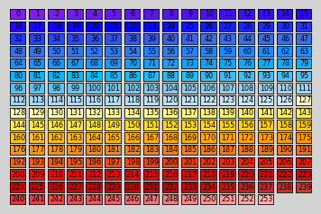
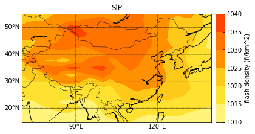

# 利用ncmaps 绘制一张海平面气压图

### 数据 
slp.mon.mean.nc (该数据在data中方便下载使用)


### Step1 查看ncl官方调色板对应的色号(以官方默认调色板为例)


```python
from ncmaps import Cmaps
%matplotlib inline
#本例中所选取ncl的官网调色板为ncl_default
#ncmaps 默认的调色板也是ncl_default
rgb_file = 'ncl_default'
#以下是核心api,实质为调用Cmaps基类的show()方法,该方法会创建一个新的进程绘制如下图片，
#注意此方法还可以替换成plot(),效果依然如图，只不过要手动关闭图片才能进一步执行后续代码
#由于查看调色板色号仅用于代码调试,故建议不使用时将下面代码注释如：#cmaps = Cmaps('NCV_blu_red').show()

cmaps = Cmaps(rgb_file).show()

#由于ncl_default为ncmaps默认的调色板，故上述代码也可以写成
#cmaps = Cmaps().show()


```





### Step２ 绘制全球的slp的contour


```python
from netCDF4 import Dataset
import numpy as np
%matplotlib inline
import matplotlib.pyplot as plt
from mpl_toolkits.basemap import Basemap

from ncmaps import Cmaps
# 根据ncl官网额ncl_default自定义调色板
rgb_file = 'ncl_default'

self_define_list = [138,148,158,168,178,188,198]
cmaps = Cmaps(rgb_file,self_define_list).listmap()
#Cmaps().show()

# 获取数据
meteo_file = '../data/slp.mon.mean.nc'
fh = Dataset(meteo_file, mode='r')

# 获取每个变量的值
lon = fh.variables['lon'][:]
lat = fh.variables['lat'][:]
slp = fh.variables['slp'][:]
slp_units = fh.variables['slp'].units
#　所绘制slp的时次
slp_0 = slp[0, ::, ::]

levels = [1010,1015,1020,1025,1030,1035,1040]
# 绘图
fig,ax = plt.subplots()
m = Basemap(llcrnrlat=15,urcrnrlat=55,llcrnrlon=70,urcrnrlon=140)

m.drawcoastlines() # 绘制海岸线
m.drawstates()    # 绘制美国州界
m.drawcountries()  # 绘制国界
# 绘制纬度线
parallels = np.arange(-90.,91,10.)
m.drawparallels(parallels,labels=[1,0,0,0],fontsize=10)
# 绘制经度线
meridians = np.arange(-180.,181.,30.)
m.drawmeridians(meridians,labels=[0,0,0,1],fontsize=10)

# 网格化经纬度，并进行投影转换坐标            
lons, lats = np.meshgrid(lon, lat)
x, y = m(lons, lats)

# 调色板的使用　默认时ncl的调色板
con = m.contourf(x, y, slp_0, cmap = cmaps, spacing = 'uniform',levels = levels)
# 添加标题
ax.set_title('SlP')

cax = m.colorbar(con, cmap = cmaps, ax = ax)
cax.set_ticks(levels)
cax.ax.tick_params(direction = 'in')
cax.set_label('flash density (fl/km^2)')

plt.show()

```





### 备注 如何查看ncmaps提供的ncl调色板


```python
from ncmaps import Cmaps
#以下是核心api,实质为调用Cmaps基类的listmap()方法
print(Cmaps())
```

    MPL_Greys.rgb
    precip_diff_1lev.rgb
    GMT_hot.rgb
    seaice_2.rgb
    uniform.rgb
    MPL_coolwarm.rgb
    BlueDarkOrange18.rgb
    amwg256.rgb
    precip3_16lev.rgb
    GrayWhiteGray.rgb
    detail.rgb
    tbrVar1.rgb
    MPL_PuBuGn.rgb
    MPL_s3pcpn_l.rgb
    cosam.rgb
    cmp_flux.rgb
    NCV_manga.rgb
    MPL_spring.rgb
    GMT_gebco.rgb
    amwg.rgb
    MPL_YlGnBu.rgb
    MPL_gnuplot2.rgb
    NCV_rainbow2.rgb
    MPL_Oranges.rgb
    GMT_paired.rgb
    rh_19lev.rgb
    GMT_no_green.rgb
    MPL_PuBu.rgb
    hotcolr_19lev.rgb
    GMT_relief.rgb
    radar.rgb
    temp_diff_1lev.rgb
    GreenYellow.rgb
    ViBlGrWhYeOrRe.rgb
    amwg_blueyellowred.rgb
    gscyclic.rgb
    CBR_drywet.rgb
    NCV_blue_red.rgb
    MPL_summer.rgb
    testcmap.rgb
    MPL_gist_stern.rgb
    grads_default.rgb
    tbrStd1.rgb
    MPL_rainbow.rgb
    wind_17lev.rgb
    gsltod.rgb
    NCV_gebco.rgb
    NMCVel.rgb
    tbr_var_0-500.rgb
    sunshine_diff_12lev.rgb
    MPL_BuGn.rgb
    Cat12.rgb
    MPL_gist_heat.rgb
    MPL_PRGn.rgb
    SVG_feb_sunrise.rgb
    precip2_15lev.rgb
    rainbow+white.rgb
    NCV_jaisnd.rgb
    MPL_terrain.rgb
    ncview_default.rgb
    GreenMagenta16.rgb
    WhViBlGrYeOrReWh.rgb
    MPL_Paired.rgb
    posneg_1.rgb
    nrl_sirkes_nowhite.rgb
    matlab_jet.rgb
    OceanLakeLandSnow.rgb
    MPL_gist_ncar.rgb
    cb_9step.rgb
    prcp_1.rgb
    rainbow+white+gray.rgb
    temp1.rgb
    prcp_2.rgb
    3gauss.rgb
    GMT_copper.rgb
    psgcap.rgb
    NCV_blu_red.rgb
    cmp_haxby.rgb
    MPL_GnBu.rgb
    cb_rainbow_inv.rgb
    MPL_PuRd.rgb
    so4_21.rgb
    hlu_default.rgb
    MPL_Blues.rgb
    helix1.rgb
    WhiteYellowOrangeRed.rgb
    example.rgb
    MPL_prism.rgb
    BlueRed.rgb
    seaice_1.rgb
    GMT_drywet.rgb
    MPL_pink.rgb
    topo_15lev.rgb
    MPL_ocean.rgb
    circular_0.rgb
    SVG_Lindaa06.rgb
    MPL_RdPu.rgb
    CBR_coldhot.rgb
    gui_default.rgb
    NCV_jet.rgb
    spread_15lev.rgb
    BkBlAqGrYeOrReViWh200.rgb
    MPL_YlGn.rgb
    tbrAvg1.rgb
    tbr_240-300.rgb
    GMT_nighttime.rgb
    MPL_RdBu.rgb
    MPL_BuPu.rgb
    StepSeq25.rgb
    MPL_autumn.rgb
    BlAqGrWh2YeOrReVi22.rgb
    mch_default.rgb
    MPL_PuOr.rgb
    nice_gfdl.rgb
    matlab_hot.rgb
    MPL_Greens.rgb
    MPL_RdGy.rgb
    helix.rgb
    sunshine_9lev.rgb
    MPL_cubehelix.rgb
    MPL_gnuplot.rgb
    CBR_wet.rgb
    MPL_sstanom.rgb
    GMT_topo.rgb
    gsdtol.rgb
    MPL_hsv.rgb
    MPL_RdYlGn.rgb
    precip4_diff_19lev.rgb
    MPL_seismic.rgb
    GMT_polar.rgb
    MPL_Pastel1.rgb
    MPL_gist_yarg.rgb
    WhViBlGrYeOrRe.rgb
    BlueGreen14.rgb
    rainbow.rgb
    SVG_fs2006.rgb
    MPL_cool.rgb
    wh-bl-gr-ye-re.rgb
    BlueYellowRed.rgb
    GMT_wysiwygcont.rgb
    nrl_sirkes.rgb
    GMT_wysiwyg.rgb
    SVG_Lindaa07.rgb
    default.rgb
    BlueDarkRed18.rgb
    GMT_panoply.rgb
    ncl_default.rgb
    GMT_split.rgb
    tbr_stdev_0-30.rgb
    BlWhRe.rgb
    cyclic.rgb
    GMT_cool.rgb
    MPL_Pastel2.rgb
    precip_11lev.rgb
    GMT_ocean.rgb
    MPL_bone.rgb
    MPL_Reds.rgb
    posneg_2.rgb
    MPL_Set2.rgb
    thelix.rgb
    MPL_jet.rgb
    SVG_es_landscape_79.rgb
    cb_rainbow.rgb
    percent_11lev.rgb
    MPL_OrRd.rgb
    SVG_bhw3_22.rgb
    MPL_BrBG.rgb
    WhBlGrYeRe.rgb
    GMT_globe.rgb
    SVG_Gallet13.rgb
    WhiteGreen.rgb
    MPL_PiYG.rgb
    WhBlReWh.rgb
    MPL_RdYlBu.rgb
    temp_diff_18lev.rgb
    MPL_bwr.rgb
    MPL_YlOrBr.rgb
    MPL_Spectral.rgb
    prcp_3.rgb
    hotcold_18lev.rgb
    NCV_bright.rgb
    MPL_gist_gray.rgb
    WhiteBlue.rgb
    precip_diff_12lev.rgb
    GMT_seis.rgb
    BlGrYeOrReVi200.rgb
    rainbow+gray.rgb
    BrownBlue12.rgb
    GMT_jet.rgb
    wxpEnIR.rgb
    MPL_flag.rgb
    matlab_hsv.rgb
    MPL_afmhot.rgb
    MPL_gist_earth.rgb
    BlAqGrYeOrRe.rgb
    BlueRedGray.rgb
    temp_19lev.rgb
    MPL_brg.rgb
    CBR_set3.rgb
    MPL_winter.rgb
    MPL_YlOrRd.rgb
    3saw.rgb
    WhiteBlueGreenYellowRed.rgb
    BlAqGrYeOrReVi200.rgb
    GMT_relief_oceanonly.rgb
    lithology.rgb
    MPL_Dark2.rgb
    so4_23.rgb
    MPL_Set1.rgb
    precip2_17lev.rgb
    radar_1.rgb
    MPL_gist_rainbow.rgb
    NCV_roullet.rgb
    NMCRef.rgb
    MPL_Set3.rgb
    GMT_haxby.rgb
    cmp_b2r.rgb
    GMT_gray.rgb
    MPL_Purples.rgb
    matlab_lines.rgb
    MPL_Accent.rgb
    extrema.rgb
    BlRe.rgb
    wgne15.rgb
    BlueWhiteOrangeRed.rgb
    cosam12.rgb
    grads_rainbow.rgb
    t2m_29lev.rgb
    MPL_StepSeq.rgb
    NCV_banded.rgb
    SVG_foggy_sunrise.rgb
    GHRSST_anomaly.rgb
    MPL_s3pcpn.rgb
    MPL_copper.rgb
    perc2_9lev.rgb
    circular_1.rgb
    circular_2.rgb
    GMT_red2green.rgb
    hotres.rgb
    MPL_hot.rgb
    precip4_11lev.rgb
    None

